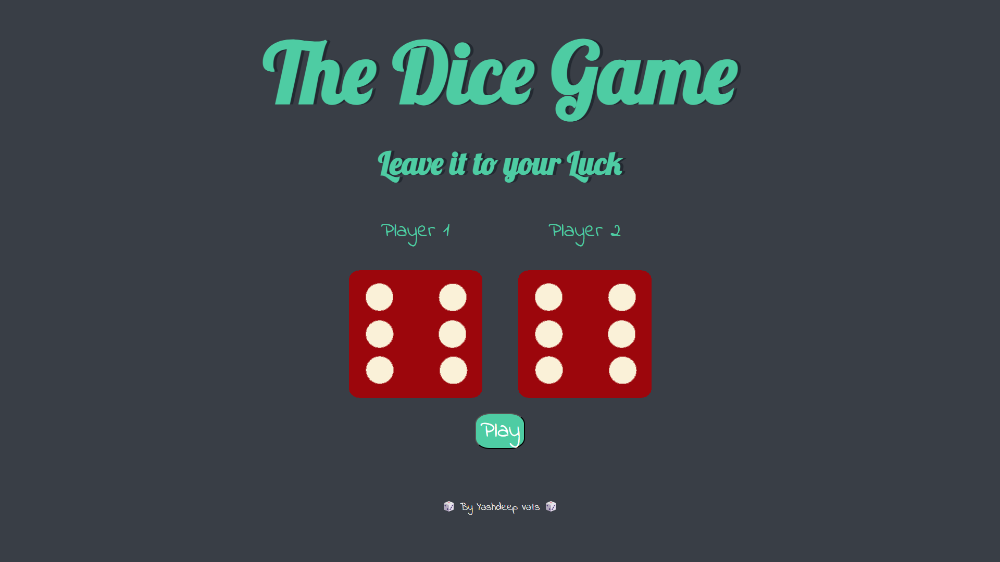
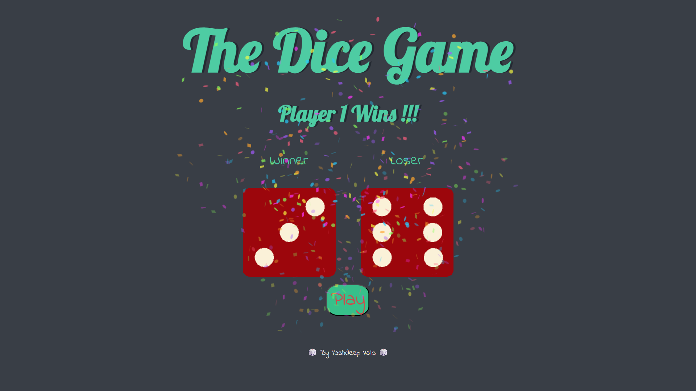

# Roll Off 🎲

**“When words don’t settle it — roll for it.”**  
Perfect for quick duels between friends. One roll, one winner. No luck excuses.




## 🔗 Live Demo
If hosted (optional):  
[Click Here](https://yashdeep7.github.io/RollOff/)

## 📖 Extended Description
Roll Off is an interactive web application designed to make quick decisions fun and fair. 
The app features two animated dice rolls, and a confetti celebration for the winner, making it visually engaging.

Key features include:

- **Animated Dice Rolls**: Both dice roll with smooth animations when triggered.  
- **Confetti Celebration**: Winner triggers a confetti animation for a fun effect.  
- **Minimalistic Design**: Clean and intuitive interface focused on interaction.  
- **Responsive Layout**: Works well on desktop and mobile devices.

This project helped me learn:

- DOM manipulation and event handling in JavaScript  
- Adding CSS and JS animations for interactive UI  
- Handling random number generation for game logic

Future improvements:

- Allow custom player names  
- Feature of having mmore than 2 dices 

## 🛠️ Built With
- HTML5  
- CSS3  
- JavaScript

## 🚀 How to Run Locally
1. Clone the repo:
   ```bash
   git clone https://github.com/yashdeep7/RollOff.git
